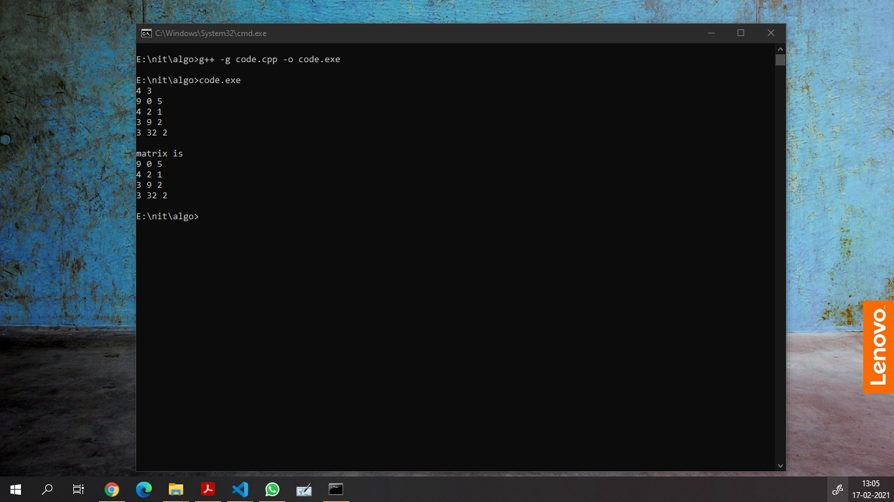

# Passing 2D as argument

Hence here i used **malloc** to assign space to the double pointer a(which in this case is our 2D array)

    r : no of rows 
    c : no of columns 

```C++
#include<bits/stdc++.h>
using namespace std;
#define ll long long int
#define co cout<<


void inputMatrix(ll **a, ll r, ll c){
    for (ll i = 0; i < r; i++)
    {
        for (ll j = 0; j < c; j++)
        {
            cin>>a[i][j];
        }
    }

}
void outputMatrix(ll **a, ll r, ll c){
    for (ll i = 0; i < r; i++)
    {
        for (ll j = 0; j <c; j++)
        {
            cout << a[i][j]<<" ";
        }
        cout <<endl;
    }
}

int main(){

    // #ifndef ONLINE_JUDGE
    //     freopen("input.txt", "r", stdin);
    //     freopen("output.txt", "w", stdout);
    // #endif

    // int T;
    // cin>>T;
    // for (int tc = 0; tc < T; tc++){
        ll r, c;
        cin>>r>> c;

        ll **a;
        a = (ll **)malloc(r * sizeof(*a) );
        for (ll i = 0; i < r; i++)
        {
            a[i] = (ll *)malloc(c * sizeof(*a[i]));
        }
        

        inputMatrix(a, r, c);

        cout <<"\nmatrix is\n";
        outputMatrix(a, r, c);

    // }

    return 0;
}

```

