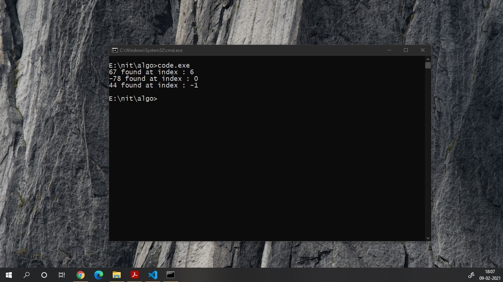

# Binary Search

+ assuming 0-based indexing 
+ array need to be sorted initially
+ complexity O(lgn), if we take arrays as data structure 


```C++
#include<bits/stdc++.h>
using namespace std;
#define ll long long int
#define co cout<<


int binarySearch(int a[], int n, int data)  // O(lgn) // returns index of an ele if found in array , else returns -1
{
    int lb = 0, ub = n-1 ;

    while(lb<=ub)
    {
        int mid = (lb+ub)/2;
        if(a[mid] == data){
            return mid;
        }else if(a[mid] > data){
            ub = mid-1;
        }else{
            lb = mid+1;
        }
    }return -1;
}

int main(){

    // #ifndef ONLINE_JUDGE
    //     freopen("input.txt", "r", stdin);
    //     freopen("output.txt", "w", stdout);
    // #endif

    // ll T;
    // cin>>T;
    // for (ll tc = 0; tc < T; tc++){
        int arr[9] = {-78, -2, -1, 0, 34, 45, 67, 89, 100};

        cout <<67 <<" found at index : "<< binarySearch(arr,9,67)<<endl;
        cout <<-78 <<" found at index : "<< binarySearch(arr,9,-78)<<endl;
        cout <<44 <<" found at index : "<< binarySearch(arr,9,44)<<endl;
    // }

    return 0;
}

/*

Sample input 

Sample output 

*/
```

